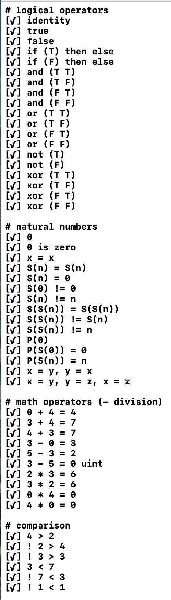

# λ-Calculus with Swift

## progress

## I got the idea from
- [gtramontina/lambda](https://github.com/gtramontina/lambda)
- [Lambda Calculi](https://www.iep.utm.edu/lambda-calculi/)
- [GOTO 2015 - Fun with Lambda Calculus - Corey Haines](https://www.youtube.com/watch?v=QPqoFCHpLF4)
